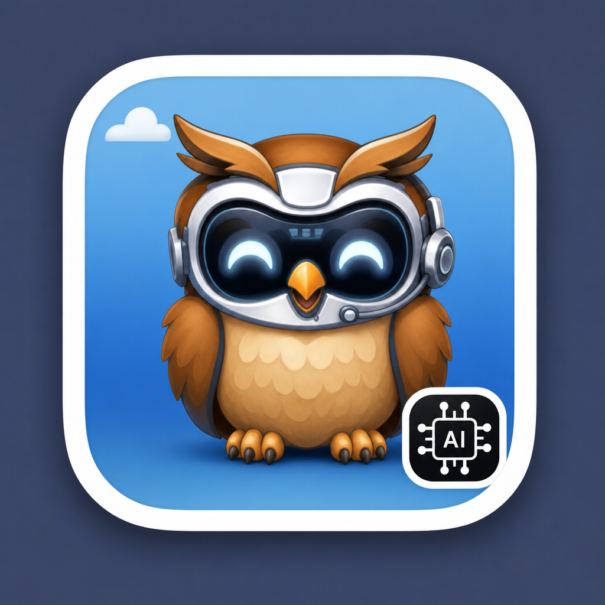

<div align="center">



# DevHub-AI

**Your local project command center for macOS.**

Manage every project, terminal session, and AI agent from a single native desktop app.

[](https://github.com)
[](https://www.electronjs.org/)
[](https://react.dev)
[](https://www.typescriptlang.org/)
[](LICENSE)

</div>

---

<div align="center">

</div>

## Why DevHub-AI?

Most developers juggle a dozen tools just to keep their projects running: one terminal here, a browser tab there, an IDE somewhere else, and a half-forgotten `localhost:3000` that is still bound to a dead process. DevHub-AI replaces that chaos with a single window.

- **See everything at a glance** — every project, its status, port, and tech stack on one screen
- **Run Claude sessions with real terminals** — not a chat widget, a full `zsh` shell with `node-pty` and `xterm.js`
- **Control a browser from the command line** — navigate, screenshot, click, and type through a `browser` CLI injected into every session
- **Automate with agents** — discover and manage your scheduled Claude-powered scripts and LaunchAgents
- **Stay in flow** — keyboard-first navigation, session persistence, git worktrees, and one-click IDE launching

---

## Features

### Launchpad

Scan any directory and instantly see every project as a card. Each card shows the detected tech stack, custom tags, configured port, and live status. Start, stop, view logs, and open in your favorite editor — all without leaving DevHub-AI.

<details>
<summary><strong>Screenshot — Launchpad with project grid</strong></summary>
<br />
<div align="center">

</div>
</details>

**Highlights:**
- Auto-detects tech stack from `package.json`, `Cargo.toml`, `pyproject.toml`, and more
- Filter by tags, running status, or free-text search (`Cmd+K`)
- Detects externally running ports so you never wonder "is this already up?"
- Bulk select, hide, or remove projects
- One-click open in **Cursor**, **Zed**, **Terminal**, or **Finder**

---

### All Folders

Browse every folder in your workspace with git branch info, remote status, and modification time. Hover any row to reveal quick-launch buttons for Claude, Cursor, Zed, Terminal, and Finder.

<details>
<summary><strong>Screenshot — All Folders with quick actions</strong></summary>
<br />
<div align="center">

</div>
</details>

---

### Claude Sessions

Embedded terminal sessions running the Claude CLI inside a real shell. Each session gets its own git worktree for isolated development and can be resumed at any time.

**What makes this different from a plain terminal:**

| Capability | Description |
|---|---|
| **Chat input bar** | Cursor-style input with `@` file mentions, `/` slash commands, model & effort selectors, image upload, and context usage tracking. Model picker includes **Claude Opus 4.7**, **Sonnet 4.6**, **Opus 4.6**, and **Haiku 4.5** |
| **Session history** | Browse, search, and resume past conversations with auto-generated titles and keyword tags — keeps 6 months of history |
| **Auto-recap on resume** | Resuming a session automatically asks Claude to summarize what happened so you can pick up where you left off |
| **Full state persistence** | DevHub-AI remembers the last active tab, project, and Claude session so you reopen exactly where you left off |
| **Waiting indicators** | A pulsing dot appears on the session card and Claude tab when an agent is idle and waiting for your input — never miss a prompt |
| **Git worktrees** | Every session gets an isolated branch — no conflicts with your main work. Worktree sessions resume into the correct directory |
| **File explorer & search** | Browse project files and search content in a unified side panel |
| **Diff viewer** | Review all changes Claude made before committing |
| **MCP & Skills panel** | View and manage MCP servers, skills, and custom commands |
| **Browser panel** | View web pages inline without switching windows |
| **Pipeline** | Autonomous task execution: plan → implement → validate → review |
| **Prompt Enhancer** | AI-powered prompt improvement — rewrite a rough idea into a focused, context-aware prompt before sending (uses OpenAI, configurable) |

---

### Agents

Automatically discovers Claude-powered agents from `~/.claude/scripts` and macOS LaunchAgents. View schedules, live status, cost tracking, and output logs. Trigger any agent manually with one click.

<details>
<summary><strong>Screenshot — Agents dashboard</strong></summary>
<br />
<div align="center">

</div>
</details>

---

### DB Access

A built-in MySQL workbench tab that opens read-only tunnels through [Akeyless](https://www.akeyless.io/) and lets you query production and staging databases without leaving DevHub-AI. Pick a profile, run SQL, and view results in a clean grid — all credentials stay scoped to the tunnel lifetime.

**Highlights:**
- One-click tunnel management per Akeyless profile
- SQL editor with query history and result pagination
- Safe defaults (read-only unless explicitly toggled)

---

### Browser Bridge

DevHub-AI injects a `browser` CLI command into every Claude session. This gives Claude (or you) direct control over a real browser window — no Puppeteer setup, no boilerplate.

```bash
browser navigate https://localhost:3000    # open a page
browser screenshot                         # capture what's on screen
browser click '#submit-btn'                # click an element
browser type '#email' hello@test.com       # type into an input
browser text                               # get visible page text
browser evaluate 'document.title'          # run arbitrary JS
```

The browser window persists across commands and works with any local or remote URL. Screenshots are saved to disk so Claude can reference them.

---

## Quick Start

### Prerequisites

| Requirement | Minimum |
|---|---|
| **macOS** | 10.15 Catalina |
| **Node.js** | 18+ |
| **git** | any recent version |
| **Claude CLI** | `npm i -g @anthropic-ai/claude-code` |
| **Xcode CLI Tools** | `xcode-select --install` (for native `node-pty` build) |

### Install & Run

```bash
# Clone
git clone https://github.com/BorisSlutski/devhub-ai.git
cd devhub-ai

# Install dependencies
npm install

# Run in development mode (hot reload)
npm run dev
```

### Build & Package

```bash
# Production build
npm run build

# Package as macOS .app (uses resources/icon.icns for Dock & Finder)
npm run package
```

### Install on macOS (Applications folder)

After `npm run package`, install the app so it appears in **Launchpad**, **Spotlight**, and the **Dock** with the DevHub-AI icon:

**Option A — one command (recommended)**

```bash
npm run install-app
```

This copies `dist/DevHub-AI.app` to `/Applications/DevHub-AI.app` and clears quarantine flags.

**Option B — manual copy**

```bash
cp -R dist/DevHub-AI.app /Applications/
xattr -dr com.apple.quarantine /Applications/DevHub-AI.app
open /Applications/DevHub-AI.app
```

**Option C — Finder**

1. Open the `dist` folder in the project.
2. Drag **DevHub-AI.app** into **Applications** (or onto the Applications shortcut in a Finder sidebar).
3. Double-click **DevHub-AI** in Applications to launch.

**Keep the icon in the Dock (task bar)**

1. Open DevHub-AI from Applications (or Spotlight: `Cmd+Space`, type `DevHub-AI`).
2. Right-click the app icon in the Dock.
3. Choose **Options → Keep in Dock**.

**Icon still shows the old Electron logo?**

| If you launch via… | Icon you see |
|---|---|
| `npm run dev` | Custom **DevHub-AI** icon (after `npm run icons` or `npm run patch-dev-icon`) |
| `/Applications/DevHub-AI.app` | Custom **DevHub-AI** hub icon |

Fix a stale **dev** icon (`npm run dev` still shows Electron):

```bash
npm run icons            # regenerates icon.icns and patches node_modules/electron
# or: npm run patch-dev-icon
# Quit any running Electron/DevHub-AI, then:
npm run dev
```

Fix the **installed** app icon:

```bash
npm run icons          # regenerate icon.icns from icon.svg
npm run install-app    # reinstall to /Applications
npm run refresh-icon   # re-copy icon + restart Dock cache + launch app
open /Applications/DevHub-AI.app
```

If Finder still shows the old icon, log out and back in (macOS caches app icons aggressively).

**Regenerate app icon assets** (from `resources/icon.svg`):

```bash
npm run icons    # writes icon.png and icon.icns from icon.svg
npm run package  # rebuild .app with new icon
```

**Developer install** (symlinks source into `/Applications` for fast iteration):

```bash
npm run install-dev
npm run build    # rebuild after code changes, then relaunch
```

---

## First-Time Setup

1. **Install Claude CLI** if you haven't already:
   ```bash
   npm install -g @anthropic-ai/claude-code
   ```

2. **Set your workspace path** in the Launchpad tab (defaults to `~/Workspace`). DevHub-AI scans this directory to discover projects.

3. **Click Scan** to populate the project grid. Projects are detected by the presence of `package.json`, `Cargo.toml`, `pyproject.toml`, and similar manifest files.

4. **Optional — add agents** by placing scripts in `~/.claude/scripts` or configuring macOS LaunchAgents. DevHub-AI discovers and lists them automatically.

---

## Keyboard Shortcuts

| Shortcut | Action |
|---|---|
| `Cmd+K` | Focus search / clear terminal |
| `Cmd+1` | Launchpad tab |
| `Cmd+2` | All Folders tab |
| `Cmd+3` | Claude tab |
| `Cmd+4` | Agents tab |
| `Cmd+5` | DB Access tab |
| `Esc` | Close modal / exit mode |
| `?` | Show shortcuts help |
| `Cmd++ / Cmd+-` | Zoom terminal font |
| Drag & drop images | Paste image paths into terminal |

---

## Architecture

```
src/
├── main/                  # Electron main process
│   ├── index.ts           # Window creation, IPC handlers
│   ├── store.ts           # State persistence (JSON)
│   ├── scanner.ts         # Project discovery & tech detection
│   ├── process-manager.ts # Start/stop project processes
│   ├── pty-manager.ts     # Terminal sessions via node-pty
│   ├── session-history.ts # Session persistence, history scanning, title extraction, active-session tracking
│   ├── prompt-enhancer.ts # Prompt Enhancer (AI-powered prompt rewriting)
│   ├── pipeline-manager.ts# Autonomous task pipeline
│   ├── browser-bridge.ts  # Browser control server
│   ├── akeyless-db.ts     # DB Access — Akeyless tunnel & MySQL client
│   └── agent-scanner.ts   # Agent discovery
├── preload/
│   └── index.ts           # IPC bridge (contextBridge)
├── renderer/              # React UI
│   ├── App.tsx
│   ├── components/        # Launchpad, Claude, Agents, etc.
│   └── hooks/             # Keyboard shortcuts, state
└── shared/
    └── types.ts           # Shared TypeScript interfaces
```

### Tech Stack

| Layer | Technology |
|---|---|
| Desktop runtime | Electron 33 |
| UI framework | React 19 |
| Language | TypeScript 5.7 |
| Bundler | Vite 6 (via electron-vite) |
| Terminal | xterm.js + node-pty |
| Testing | Vitest + Playwright |

---

## Data & Configuration

| Path | Purpose |
|---|---|
| `~/Library/Application Support/devhub-ai/state.json` | Persisted app state (active tab, selected project, projects list) |
| `~/Library/Application Support/devhub-ai/enhancer-config.json` | Prompt Enhancer configuration |
| `~/.devhub-ai/worktrees/` | Git worktrees for sessions & pipeline |
| `~/.devhub-ai/active-sessions.json` | Active session tracking + last-active session id for auto-resume |
| `~/.devhub-ai/tmp-images/` | Browser bridge screenshots |
| `~/.devhub-ai/browser` | CLI helper script (auto-injected into PATH) |
| `~/.claude/projects/` | Claude Code session history (read-only, scanned for session history) |

---

## Development

```bash
# Development with hot reload
npm run dev

# Run unit tests
npm test

# Run tests in watch mode
npm run test:watch

# Run tests with coverage
npm run test:coverage

# Run end-to-end tests
npm run test:e2e
```

Main process changes require an app restart. Renderer changes reload automatically.

---

## Troubleshooting

<details>
<summary><strong>node-pty fails to build</strong></summary>

`node-pty` requires native compilation. Install Xcode Command Line Tools and reinstall:

```bash
xcode-select --install
npm install
```
</details>

<details>
<summary><strong>Claude CLI not found</strong></summary>

Ensure Claude is installed globally and on your PATH:

```bash
npm install -g @anthropic-ai/claude-code
which claude
```
</details>

<details>
<summary><strong>Port already in use</strong></summary>

DevHub-AI detects port conflicts automatically. Check the project card status indicator and stop the conflicting process or change the port in the edit modal.
</details>

<details>
<summary><strong>Browser bridge not working</strong></summary>

The `browser` command is only available inside Claude sessions started from the Claude tab. Ensure you're in a DevHub-AI-managed session where the PATH has been configured.
</details>

<details>
<summary><strong>Sessions not resuming</strong></summary>

Active sessions are tracked in `~/.devhub-ai/active-sessions.json` and auto-resume on restart. Session history is read from Claude Code's own files in `~/.claude/projects/`. Ensure both paths are writable and not being cleared by cleanup tools.
</details>

---

## Contributing

Contributions are welcome. Please open an issue first to discuss what you'd like to change.

1. Fork the repository
2. Create your feature branch (`git checkout -b feature/amazing-feature`)
3. Commit your changes (`git commit -m 'feat: add amazing feature'`)
4. Push to the branch (`git push origin feature/amazing-feature`)
5. Open a Pull Request

---

## License

[MIT](LICENSE)
